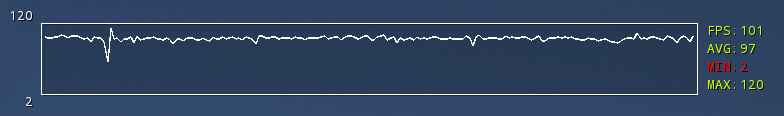

# ue5-fps-display
A simple framerate graph for Unreal Engine 5.3, created by Nick Mower.

The full tutorial can be found here: https://www.techarthub.com/show-in-game-fps-counter-unreal/

This project is licensed under the Unreal Engine 5 EULA.